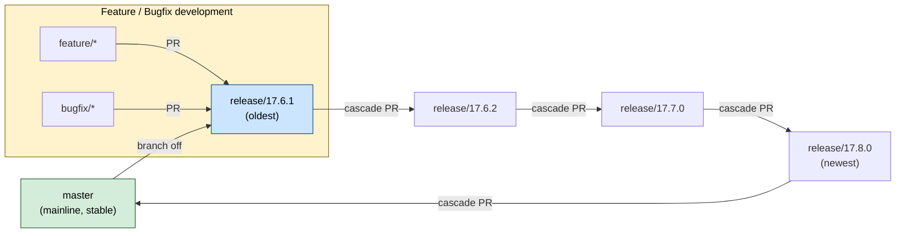

I'll consult the docx... actually, this is a markdown snippet you'll paste into the existing `.md` file, so no file creation needed. Here's the English version ready to replace the `## Algorithm` section:

```markdown
## Algorithm



Source: `common-actions/cascading-merge/cascading.py`.

The branching model follows a **cascading merge** strategy:

- **Stable mainline** — `master` is the default, stable branch. When a release is needed, a `release/*` branch is cut from `master` (branch off).
- **Branch-based development** — `feature/*` and `bugfix/*` branches are created off the relevant `release/*` branch and merged back into it via PR. Development never targets `master` directly.
- **Cascading merge** — any change merged into the **oldest** release is automatically propagated forward through `cascade PR`s, release by release in order (`release/17.6.1 → 17.6.2 → 17.7.0 → 17.8.0`), and finally merged into `master`. This guarantees a fix introduced in an older release is never lost in newer ones — every branch newer than it receives the change.
```

Note the outer ```` ``` ```` fences are just to show the block here — when you paste, keep the inner `mermaid` code fence intact. Want me to also update the numbered `## Algorithm` steps (the `1. **Guard**...` list visible below line 26) to reference the cascading flow?